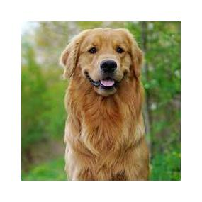
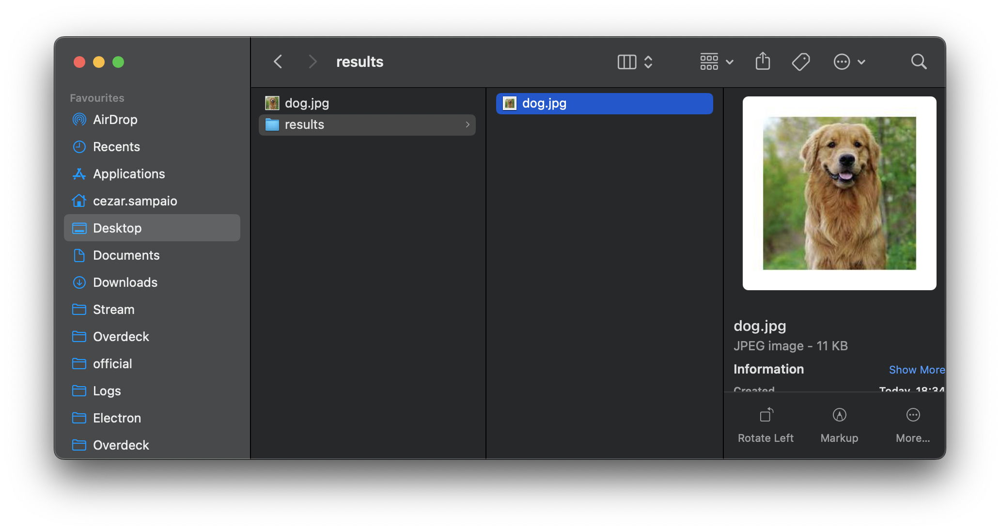

# Image Border

This program adds a border with a specified color to all JPEG images in a given folder.


Becomes





## Installation

1. Make sure you have Go installed on your system. You can download it from the [official Go website](https://golang.org/dl/).
2. Clone this repository or download the `main.go` file.
3. Navigate to the directory containing the `main.go` file.
4. Build the program using the following command:

```shell
go build .
```

## Usage

Run the compiled executable with the following command:

```shell
./image-border -folder <folder_path> [options]
```

### Options:

- `-folder`: The folder path containing the images. This option is **required**.
- `-padding`: The padding size for the border. Default is `200`.
- `-color`: The color for the border in hexadecimal format (e.g., `#ffffff` for white). Default is `#ffffff`.

## Example

To add a white border with a padding of `100` pixels to all JPEG images in a folder named `images`, run the following command:

```shell
./image-border -folder images -padding 100 -color #ffffff
```

## Notes

- Supported image format: JPEG (\*.jpg).
- The modified images will be saved in a folder named `results`, created within the specified folder path.
- Ensure that the folder path provided contains only JPEG images.
- The program utilizes Goroutines for concurrent processing, which can significantly reduce processing time for a large number of images.
